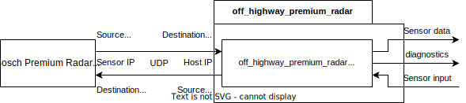

# off_highway_premium_radar

> :warning: The Radar Off-Highway Premium is not available yet. The content
> in the off_highway_premium_radar packages is preliminary and subject to change.

> :information_source: The off_highway_premium_radar packages are for the **Series** version of the
> Radar Off-Highway Premium sensor. For the Sample version go to
> [off_highway_premium_radar_sample](../off_highway_premium_radar_sample).

The off_highway_premium_radar package provides a driver node to receive and send UDP
datagrams from / to the Bosch Radar Off-Highway Premium via a ROS interface.

Further information on the Bosch Radar Off-Highway Premium can be found [here](https://www.bosch-engineering.com/stories/imaging-radar-system/).

## Supported devices

| **Device name**           | **Part Number**    | **Description**                                  |
| ------------------------- | ------------------ | ------------------------------------------------ |
| Radar Off-Highway Premium | - F037.000.158 | - Radar sensor with up to 1024 locations         |

Contact: [**off-highway.beg@bosch.com**](mailto:off-highway.beg@bosch.com?subject=off_highway_sensor_drivers%20Radar%20OHW%20Premium)

## Nodes

### Driver

The radar driver opens an UDP socket, decodes all UDP protocol data units (PDUs) from the radar and
publishes its data as ROS messages. Moreover, it can send all required input for the radar as UDP
PDUs. See the following figure for an overview:

The split location data PDUs per measurement are assembled by the driver as single location data
measurement and published as single ROS point cloud message. There is **no** built-in recovery in
the driver for out-of-order or dropped UDP packets for such a sequence of packets. A warning will
log such cases which result in a drop of the location measurement (and eventually the following one
if out-of-order packet). Such cases will also result in a publishing frequency drop for the output
message which is detected in the built-in ROS diagnosis. Reducing the load on the sensor network and
receiving device will minimize the risk of such cases.

A location data measurement may contain zero locations if the data measured flag is not set or zero
number of contained locations are measured. In addition, only locations are contained in the drivers
output which have the first bit of their measurement status set (measured and range check passed).

Each cyclic output topic of the driver is monitored via ROS topic diagnostics, which checks its
frequency and timestamp and publishes on `/diagnostics` the current status. As soon as the driver is
not receiving UDP packets with the expected frequency (see UDP interface documentation) or not
updated timestamps, the corresponding topic diagnostics will produce an error.

In order that the driver can communicate to the sensor, one needs to configure the connection via
the network parameters. The host IP, port and sensor IP, port need to be set to the settings
configured in the sensor. The defaults are stated in the UDP interface documentation and in the
[parameters](#parameters).

One can connect the used socket via the `connect_sensor` parameter to already filter for UDP packets
from the sensor before the driver process receives them. This has the main benefit of being able to
run multiple driver processes for different sensors in parallel for the same host port
([established-over-unconnected technique]).

The driver node is written as library in a modular fashion so that one can extend its functionality
with custom converter classes. See [design](doc/design.md) for an overview.

#### Subscribed topics

* **~/ego_vehicle_data
  ([`off_highway_premium_radar_msgs/EgoVehicleData`](../off_highway_premium_radar_msgs/msg/EgoVehicleInput.msg))**
  * **Optional**, subscription is deactivated per default. Can be activated via
    `send_ego_vehicle_data` ROS parameter.
  * Expected cycle time: 10 ms
  * Contains current velocity with covariance and acceleration. Only forward speed, forward speed
    variance, forward acceleration and yaw rate are used by the driver / sensor.
  * Uses SI units, so yaw rate is in [rad/s], will be converted by driver into [deg/s] of UDP
    interface specification!
  * Is converted and sent to the sensor as UDP PDU.
  * Logs error if not all bytes of UDP PDU were sent.

#### Published topics

* **~/locations
  ([`sensor_msgs/msg/PointCloud2`](http://docs.ros.org/en/noetic/api/sensor_msgs/html/msg/PointCloud2.html))**
  * Cycle time: 70 ms +/- 20 ms
  * Contains location measurement of radar as point cloud. Fields (all float for PCL filter
    compatibility, mapped Technical Customer Information signal name is specified in brackets):
    * **x, y, z**: Position of location
    * **radial_distance** (*LocData_RadDist_i_j*): Radial distance
    * **radial_velocity** (*LocData_RadRelVel_i_j*): Radial relative velocity
    * **azimuth_angle** (*LocData_AziAng_i_j*): Azimuth angle
    * **elevation_angle** (*LocData_EleAng_i_j*): Elevation angle
    * **radar_cross_section** (*LocData_Rcs_i_j*): Radar Cross Section
    * **signal_noise_ratio** (*LocData_Snr_i_j*): Strength of the received power
    * **radial_distance_variance** (*LocData_RadDistVar_i_j*): Variance of radial distance measured
    * **radial_velocity_variance** (*LocData_RadRelVelVar_i_j*): Variance of radial relative
      velocity measured
    * **azimuth_angle_variance** (*LocData_VarAzi_i_j*): Variance of azimuth angle measured
    * **elevation_angle_variance** (*LocData_VarEle_i_j*): Variance of elevation angle measured
    * **radial_distance_velocity_covariance** (*LocData_DistVelCov_i_j*): Covariance of radial
      distance and velocity measured
    * **velocity_resolution_processing_probability** (*LocData_ProVelRes_i_j*): Probability of
      velocity resolution processing
    * **azimuth_angle_probability** (*LocData_ProAziAng_i_j*): Probability for correct signal model
      for azimuth angle
    * **elevation_angle_probability** (*LocData_ProEleAng_i_j*): Probability for correct signal
      model for elevation angle
    * **measurement_status** (*LocData_MeasStat_i_j*): Measurement status
    * **idx_azimuth_ambiguity_peer** (*LocData_IdAngAmb_i_j*): Index of location peer of angle
      ambiguity
    > **Note:** See the Technical Customer Information for further information about all fields!
* **~/locations_header
  ([`off_highway_premium_radar_msgs/msg/LocationHeader`](../off_highway_premium_radar_msgs/msg/LocationDataHeader.msg))**
  * Cycle time: 70 ms +/- 20 ms (aligned to locations)
  * Contains header of location measurement including start time of measurement, operation mode and
    block counter.
* **~/sensor_state_information
  ([`off_highway_premium_radar_msgs/msg/SensorStateInformation`](../off_highway_premium_radar_msgs/msg/SensorStateInformation.msg))**
  * Cycle time: 10 ms
  * Contains sensor state.
* **~/location_attributes
  ([`off_highway_premium_radar_msgs/msg/LocationAttributes`](../off_highway_premium_radar_msgs/msg/LocationAttributes.msg))**
  * Cycle time: 70 ms +/- 20 ms (aligned to locations)
  * Contains location measurement attributes like separabilities and precisions or interference
    indicators.
* **/diagnostics
  ([`diagnostic_msgs/msg/DiagnosticArray`](http://docs.ros.org/en/noetic/api/diagnostic_msgs/html/msg/DiagnosticArray.html))**
  * Frequency: 1 Hz
  * Diagnostic status contains statuses for all published and subscribed topics.

#### Services

* **~/set_measurement_program
  ([`off_highway_premium_radar_msgs/srv/MeasurementProgram`](../off_highway_premium_radar_msgs/srv/MeasurementProgram.srv))**
  * Set the measurement program (via ID) of the radar by sending a SetMeasurementProgram UDP PDU.
    Returns success if full UDP PDU was sent, false otherwise.

#### Parameters

See [driver.yaml](config/driver.yaml).

## Launch files

* **[driver_launch.py](launch/driver_launch.py)**: Starts the driver with the given parameters.
  * Arguments:
    * **params**: Path to ROS YAML parameter file to load for driver. If not provided, default
      parameters from this package are loaded.

## Free and Open Source Software (FOSS)

This library uses a modified `UdpSocket` class from the [udp_driver
class](https://github.com/ros-drivers/transport_drivers/tree/main/udp_driver) to send and receive
UDP frames. See the [FOSS documentation](foss_documentation/) for further information.

[established-over-unconnected technique]:
https://blog.cloudflare.com/everything-you-ever-wanted-to-know-about-udp-sockets-but-were-afraid-to-ask-part-1/
